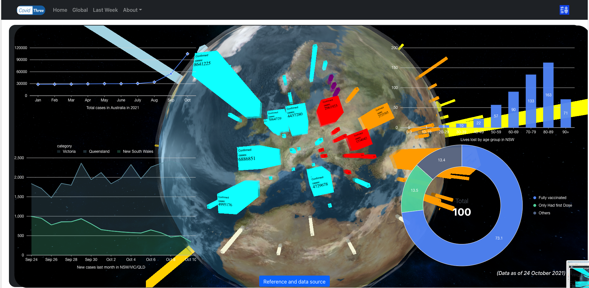

# Covid-3D online visuliaztion dashboard

This is a research project for UTS 32933 Research Project.

The App was writen with React and Three.js using 'create-react-app' cli. 

Supervisor: [Dr. Wei Liu](https://www.uts.edu.au/staff/wei.liu)

Student: Baolong Zhang 

Presentation video: https://youtu.be/mVv23h8roH4

---

## 1. Live Demo
Here are the links to the live demo of the current version of covid-3D project.

>    
> https://covid3d.github.io/
> 
> https://three-react-covid.vercel.app/  ( backup )
>  
### 1.1 Introduction

The Covid-19 pandemic has impacted the whole world from every dimension and aspects. And regarding to the current policy of the major governments
This Covid-3D online visualization platform project aims to use 3D and interactive visualizations to create the sense to help general public get the insights about Covid-19.

---
### 1.2 Previews

- In the center of the webpage. There is a 3D globe. The cuboid objects on the surface is the **Covid confirmed cases in each country**. The location of all the cuboids are base on the `longitude` and `latitude` of their country. And the `height` of cuboid is base on the *number of the cases*. If the cuboid is too high. The width of it will increase to suit the graphics.

This is the code for achieving this effects. Check the rate of how many cases per 500000 people to decide if we need to cut the height.
```js
    let casesRate = cases/500000
    if (casesRate > 3) {
        pointOfInterest = new THREE.BoxGeometry(.5, casesRate/5, .5)
    }else{
        pointOfInterest = new THREE.BoxGeometry(.1, casesRate, .1)
    }
```


On the left hand, there are two graphs. 

- The `AreaChart` in bottom left shows the comparision of **new cases in last month between VIC , NSW and QLD**. 

- On top left, there is a `lineChart` display the **total cases in Australia in 2021** . 

- On top right, there is a `bar chart` display the **lives lost in different age groups**

- on bottom right, there is a `ring chart` shows the **vaccination rate in Australia**


---
Below figure shows the indicators the on the bar

---

## 2. Getting Started

### 2.1 Intsall
Once you have download the  existing project, a local react-native binary will be available for you to use. Feel free to use Yarn to call it directly.

``` js
// Yarn
yarn install
// NPM
npm install 
```
### 2.2 Running

The React.js projects accept scripts to run the proejct locally. You can use follow scripts for different purpose. If you prefer to use **Yarn**. You can use `yarn start` to run the project in `localhost:3000` which can be access from your browser.

```js
// dev
yarn(npm) start 
// deployment 
yarn build
// test
yarn test
```
### 2.3 Deployment

In order to deploy the project online. This project offers two options to achieve this. 

1. Github pages
    After running `yarn build`. A static version of website will be generated in the `build` folder.

    
    
    Now you can push the static code into a remote Github Pages repo. And it will be able to display through  `[project-name].github.io`

2. Vercel
   When using vercel. All you need to do is connect the vercel to your GitHub account. When you have push the new commits to the selected branch and configed the automaic deployment commands. Vercel will automaticly deploy the latest version of project.

   


# 2.Key dependencies 

The key dependencies of these projects is shown below. 
- The `React` is used to build the basic components and pass the value betwwen each component. 
- The `React-router-dom` was used to navigate through different pages. 
- The `Bootstrap` was utiled to create the design of *navigation* and *cards*. 
- `React-Bootstrap` was used to integrated **React** and **Bootstrap** libraries
- `Three.js` was take in charge of creating the 3D scenes and objects. Together with the background.
- `Sass` was used to customize the design for some scenes style.
- `GeoThree` was utiled to use Geo data in Three.js

----

- React.js  17.0.2
  - react-router-dom 5.3.0
- Bootstrap 5.1.0
  - React-Bootstrap 1.6.1
- Three.js 0.131.3
- GeoThree 0.0.10
- Sass 1.39.0

# 3. File Structure
The work code is located in `src` folder. Below is the structure of this project. 

The `node_modules` is the dependacies folder that you will have it after run `yarn install` to install the dpendencies.

In `components` folder, there are two types of components 
Visualizaiton components 

- `map.js` 
- `AreaChartCustom.js` 
- `BarChart.js`
- `PieChartCustom.js` 
- `DataVisualization.js`

Support components 
- `MapDataContainer.js`

These support components will handle the data source to provide a buffer to the lower level components.

```
Project
│   README.md
│   package.json   
│
│───node_modules // You will see this after run `yarn install`
│
│───public
│          
└───src
    │   App.js
    │   App.scss
    │   index.js
    │   User.scss
    │   ···
    │───pages
    │       │   Home.js
    │        
    │───components
    │       │───charts
    │       │   │   AreaCHartCustom.js
    │       │   │   BarChart.js
    │       │   │   PieChartCustom.js
    │       │     
    │       │───Header
    │       │   │   Herader.js
    │       │      
    │       │───three
    │       │   │   DataVisualization.js
    │       │   │   Map.js
    │       │   │   MapDataContainer.js
    │       │   │   
    │       │   
    │       │───TwoDimensionMap.js
    │           
```

# 4. Futrue works

In the future, I want to integrate the library I used in another project --- `Cesium` into the project to provide the Terrain so you can zoom into details from the outter space.


